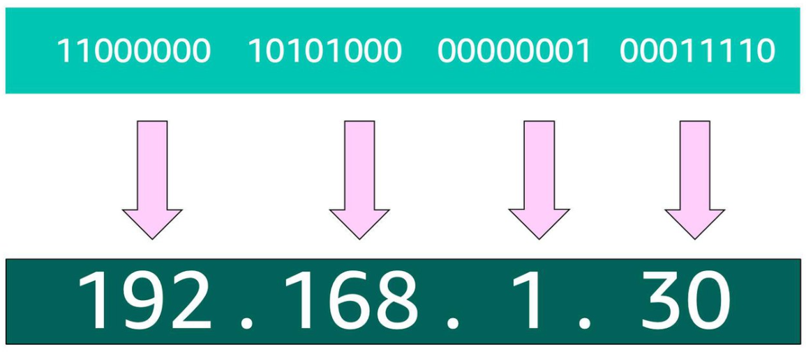
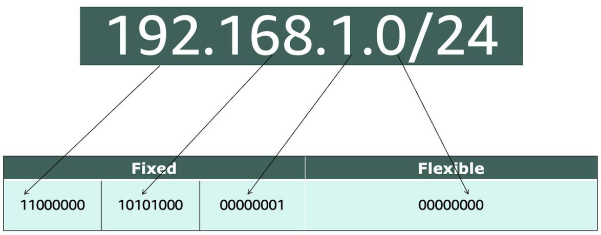
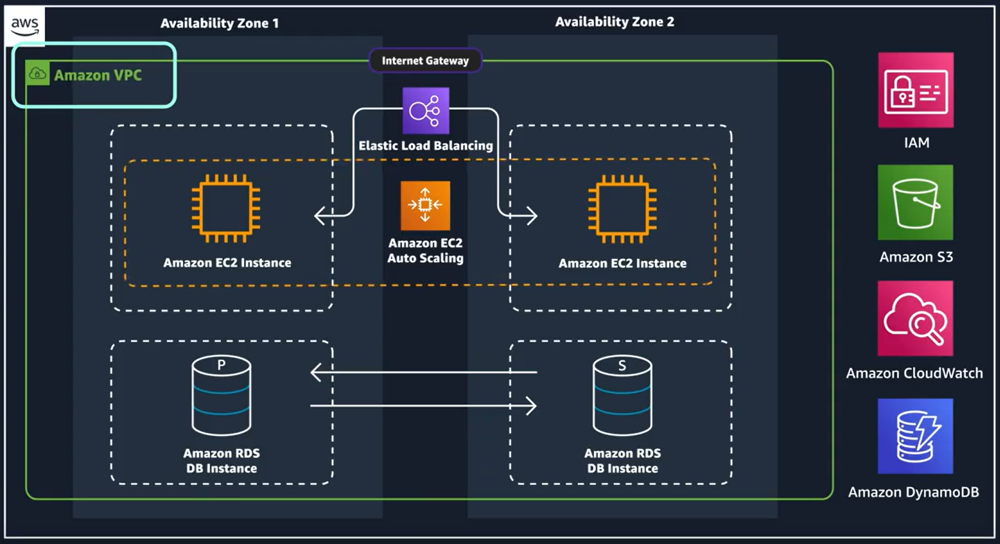
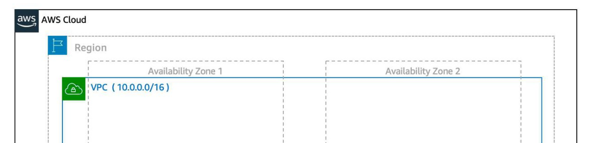
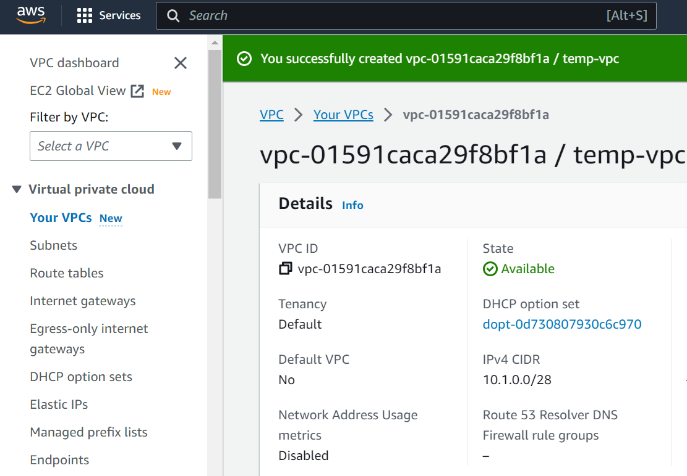
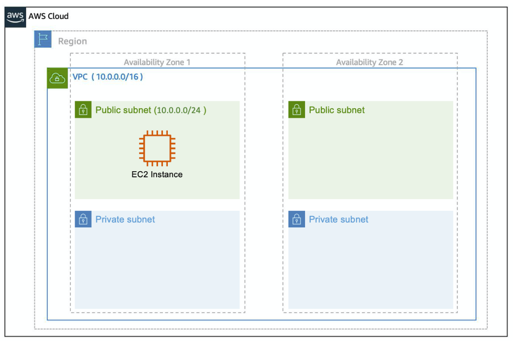

# Networking

Q)  What is networking:

- Networking is how you connect computers around the world and allow them to communicate with one another.

Q) How networking works

this concept is similar to sending letter. Every letter needs these three things
- The payload or letter inside the envelope.
- The address of the sender in the From section.
- The address of the recipient in the To section.

if we look at the details of address. Each address must contain information such as: 
- Name of sender and recipient
- Street, City, State or province, Country
- Zip, area, or postal code
 
*[Note:]* ou need all parts of an address to ensure that your letter gets to its destination. Without the correct address, postal workers are not able to properly deliver the message.

 
 
> In the digital world, computers handle the delivery of messages in a similar way. This is called **routing**. 
> and the comunication channel between the computer nodes are called **network**

  

## Address in computers

### WHAT ARE IP ADDRESSES?

- An IP address, which stands for "Internet Protocol address," is a numerical label assigned to each device connected to a computer network that uses the Internet Protocol for communication.

- In order to properly route your messages to a location, you need an address. Just like each home has a mail address, each computer has an IP address

- IP address uses a combination of bits, 0s and 1s.

- example of a 32-bit address in binary format: 
 - 11000000 10101000 00000001 00011110
 - It’s called 32-bit because you have 32 digits 
 
> **IPV4 Notation?**

- Typically, you don’t see an IP address in this binary format. Instead, it’s converted into decimal format and noted as an Ipv4 address. 

- Ex: IPv4 address
-  
- In the diagram above, the 32 bits are grouped into groups of 8 bits, also called octets. Each of these groups is converted into decimal format separated by a period. 

*[Note:]* An IP address(ex: "192.168.1.30) points to a single node(computer)

> **CIDR Notation**

- CIDR (Classless Inter-Domain Routing)
- 192.168.1.30 is a single IP address. If you wanted to express IP addresses between the range of 192.168.1.0 and 192.168.1.255, then CIDR comes into picture
- CIDR notation is a compressed way of specifying a range of IP addresses. Specifying a range determines how many IP addresses are available to you.

 

- Ex: 192.168.1.0/24
-  IP address and is separated by a forward slash (the “/” character) followed by a number. The number at the end specifies how many of the bits of the IP address are fixed. In this example, the first 24 bits of the IP address are fixed. The rest are flexible. 
-  

- 32 total bits subtracted by 24 fixed bits leaves 8 flexible bits. Each of these flexible bits can be either 0 or 1, because they are binary. That means you have two choices for each of the 8 bits, providing 256 IP addresses in that IP range.
- The higher the number after the /, the smaller the number of IP addresses in your network.

*[Note]* When working with networks **in the AWS Cloud**, you choose your network size by using CIDR notation. In AWS, the **smallest IP range** you can have is /28, which **provides you 16 IP** addresses. The **largest IP range** you can have is a /16, which **provides you with 65,536** IP addresses. 

*[Note]:* **Reserved IPs**
- AWS reserves five IP addresses in each subnet. These IP addresses are used for routing, Domain Name System (DNS), and network management. 
- 
- For example, consider a VPC with the IP range 10.0.0.0/22. The VPC includes 1,024 total IP addresses. This is divided into four equal-sized subnets, each with a /24 IP range with 256 IP addresses. Out of each of those IP ranges, there are only 251 IP addresses that can be used because AWS reserves five.  

 
 
 

 

# VPC 

A VPC in AWS creates a boundary where your applications and resources are isolated from any outside movement,
so nothing comes into the VPC and nothing comes out of the VPC without your explicit permission.

> A VPC is an isolated network you create in the AWS cloud. When you create a VPC, you need to choose three main things.
> - The name of your VPC.

> - A IP range for your VPC in CIDR notation. This determines the size of your network. Each VPC can have up to four /16 IP ranges.

> - A Region for your VPC to live in. Each VPC spans multiple Availability Zones within the Region you choose.
> - Example VPC Coverage . 

#### to create VPC, 
* login to console
* go to VPC page by searching it.
* click on create vpc. then provide name, CIDR and etc. 
* click create. done.
* 

## Subnets in VPC 
> it is small section inside VPC, that can have different set of rules like the can be exposed to internet or can be private.

> Think of subnets as smaller networks inside your base network. 

> subnets are used for high availability and providing different connectivity options for your resources. When you create a subnet, you need to choose three settings.
> - The VPC you want your subnet to live in, in this case VPC (10.0.0.0/16).

> - The Availability Zone you want your subnet to live in, in this case AZ1.

> - A CIDR block for your subnet, which must be a subset of the VPC CIDR block, in this case 10.0.0.0/24.
> Ex: 

*[Note:]* When you launch an EC2 instance, you launch it inside a subnet, which will be located inside the Availability Zone you choose.  

#### High Availability with A VPC 
> When you create your subnets, keep high availability in mind. In order to maintain redundancy and fault tolerance, create at least two subnets configured in two different Availability Zones.   

> it’s important to consider that “everything fails all the time.” In this case, if one of these AZs fail, you still have your resources in another AZ available as backup.   

 
 
 
 

////////////////////////////////
##### Question answer
Q) Why we need CIDR notation? 

Ans: 
- CIDR notation and choosing a range of IP addresses are primarily used when defining and organizing subnets within a network, such as in a Virtual Private Cloud (VPC) in AWS.
- commonly applied in scenarios where you have multiple instances, resources, and subnets within a network.
- 

#### Resources

- https://www.ionos.com/digitalguide/server/know-how/cidr-classless-inter-domain-routing/
- https://web.stanford.edu/class/cs101/network-1-introduction.html
