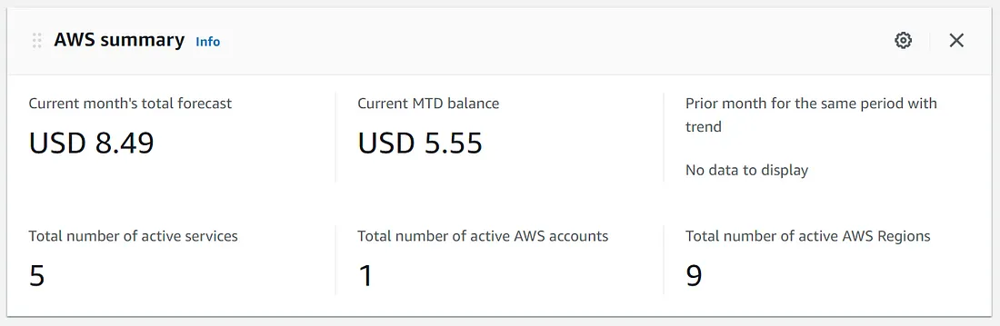
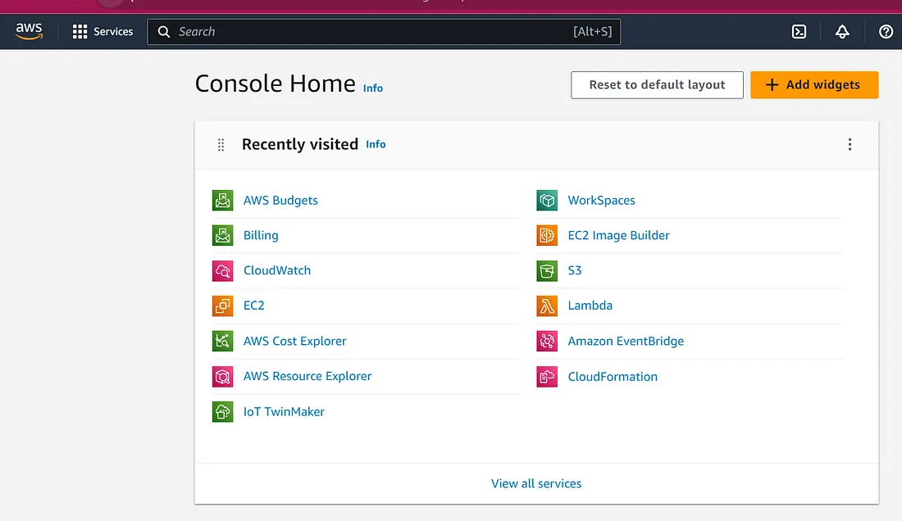
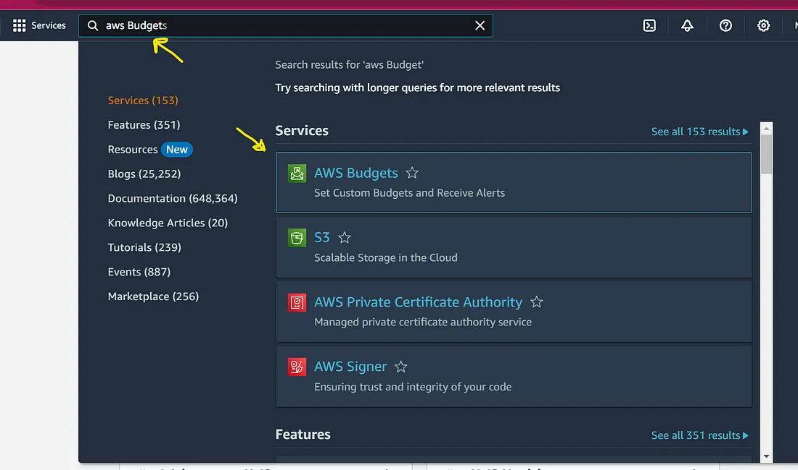
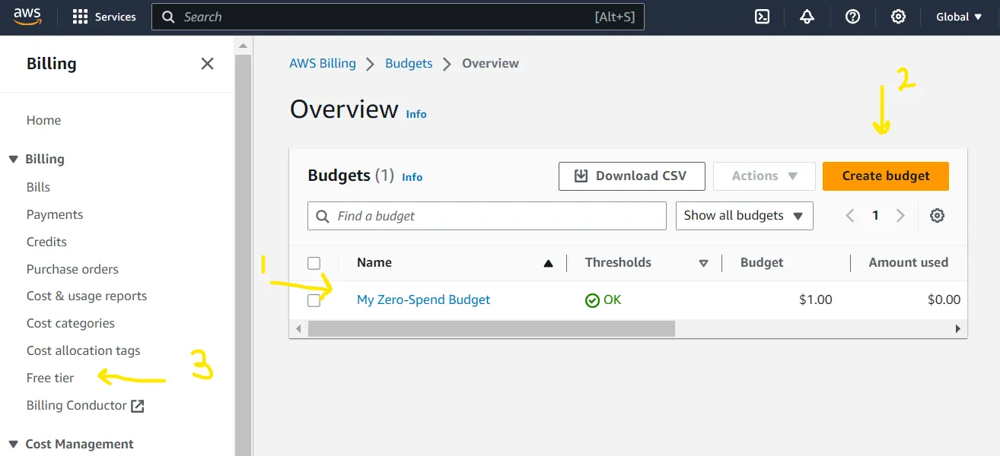

# AWS Budgets and Billing Alert | Prevent Bill

#Day05 of #100daysofAWS

## Preventing Billing

If we don’t set an alert in AWS, we won’t receive a notification if bill/fees/charges surpass a specific limit. It means we may get unexpected bills and trouble with financial problems ( in Doller :).

well I also got a small bill, after that, I immediately set up an alert and from then I regularly monitored my resource usage

// screenshot

[Note]: People also have received 1000+ $ bills because of ignorance or miscalculation. So, be careful.

**prevent unexpected costs**

*AWS feature which helps:*

- AWS Budget: feature provided by AWS to set up alerts, it notification on emails.

## AWS Budget
> AWS Budgets lets you set custom cost and usage budgets that alert you when your budget thresholds are exceeded (or forecasted to exceed).

Dashboard

> login in AWS account

Now in Search Budget in the search bar, then open ‘AWS Budgets’ from the Services option.

> It will open up the ‘Budgets page’

Let's look at the Important thing in this window

1. ‘My Zero-Spend Budget’: this one is a budget alert, I had created earlier. at first, this area should be empty.
2. ‘Create budget’: this button is used to create a budget alert.
- Click on ‘Create Budget’ to set the configuration
- Budget setup: use a template(simplified)
- Templates — new: Zero spend Budget
- Budget Name: <any-name>
- Email recipients: <provide email to receive alert>
3. ‘Free tier’: this section shows resources that have been used and the monthly forecast based on current usages.

— — END — -
