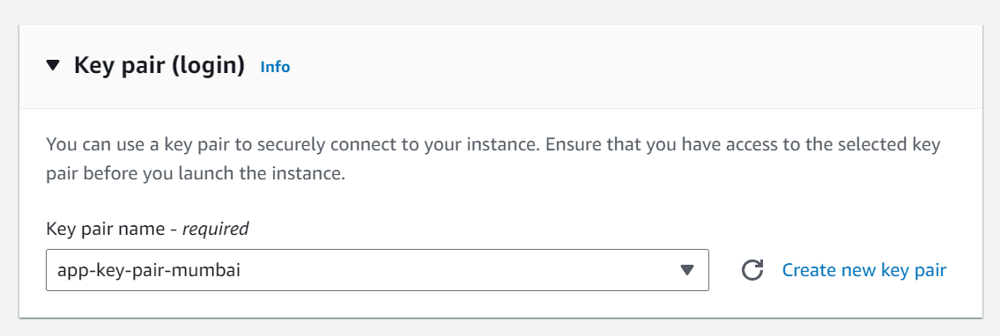

# EC2 Instance
Elastic Cloud Compute **"Practical"**

***Types of EC2 Instance***

1. General Purpose 
2. Compute Optimized (ml models, gaming servers, etc)
3. Memory Optimized (havy task, )
4. Storage Optimized
5. Acelerated

### Region and Availability Zone(AZ)

> AWS has datacenter accross the world, these are categories in form of *"region"*. 
>
> Inside a region all the datacenter are catogerised multiple *"Availability Zone"*
>
> Region > Availability Zone
> 
> ss of my dashboard
> 

 

### Creating Instance
**[Note]:** while creating instance cinsider the availability of "Free Tier" for any choice... for example: AMI, instance type, etc...

> navigate: EC2 > Instance > Launch Instance

> privide instance name
> 
> select OS
>
> Select instance Type
>
> select a existing Key pair or create a new one.
- key pairs: these key pairs are used to login to the instance
- 
- keep it safe

 

  

- click on create

- you can login with cli with the key pairs
- ex: MobeXterm, putty, 

 
 

- in instance configuration there is two IP available 'Public ip' and 'Private ip' (make sure the instance is in running state).
- 'public key' use to connect from remote device. Ex. using SSH.

**TO access it from Windows:**

Tools: PuTTY, Mobaxterm , cli, git 

> **cli use this command**

- open terminal in same file where you have stored <key.pem> file.
- 
- ssh -i <"pem file name with extension"> ec2-user@ec2-< public-ip >.< region >.compute.amazonaws.com
  (This command can be found in 'connect to instance' page in AWS);

 

 

