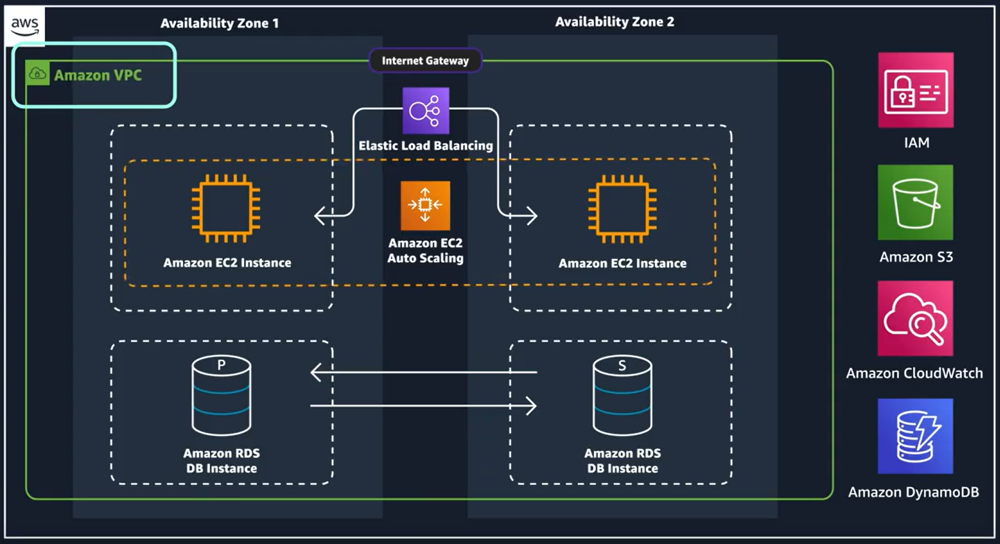

# Networking

Q)  What is networking:

- Networking is how you connect computers around the world and allow them to communicate with one another.

Q) How networking works

this concept is similar to sending letter. Every letter needs these three things
- The payload or letter inside the envelope.
- The address of the sender in the From section.
- The address of the recipient in the To section.

if we look at the details of address. Each address must contain information such as: 
- Name of sender and recipient
- Street, City, State or province, Country
- Zip, area, or postal code
 
*[Note:]* ou need all parts of an address to ensure that your letter gets to its destination. Without the correct address, postal workers are not able to properly deliver the message.

 
 
> In the digital world, computers handle the delivery of messages in a similar way. This is called **routing**. 
> and the comunication channel between the computer nodes are called **network**

  

## Address in computers

### WHAT ARE IP ADDRESSES?

- An IP address, which stands for "Internet Protocol address," is a numerical label assigned to each device connected to a computer network that uses the Internet Protocol for communication.

- In order to properly route your messages to a location, you need an address. Just like each home has a mail address, each computer has an IP address

- IP address uses a combination of bits, 0s and 1s.

- example of a 32-bit address in binary format: 
 - 11000000 10101000 00000001 00011110
 - It’s called 32-bit because you have 32 digits 
 
> **IPV4 Notation?**
